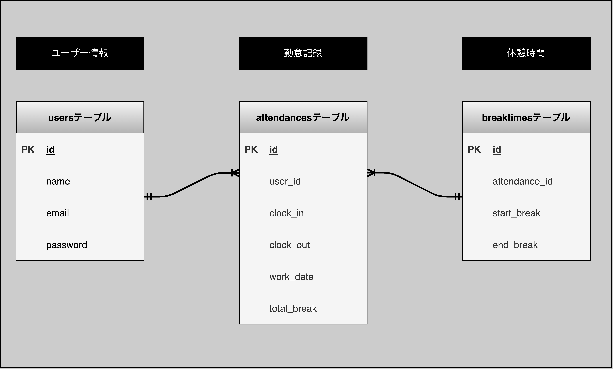

アプリケーション名
=====

勤怠打刻管理アプリ

概要説明
=====
    1 出退勤時刻、実働時間、休憩時間などを正確に記録できる。

    2 日別一覧画面、勤務者一覧画面ページにて日別の勤怠記録や勤務者別での勤怠記録を確認できる。

作成目的
=====
    1 管理者が毎回記録する手間を省き、個々で勤怠時間を打刻して記録できるようにして業務を効率化するため。

    2 勤務者自身が実際に打刻できるようにして勤務時間と休憩時間のオンオフの切り替えにもなるように。

    3 週次や日次業務を確認する際に直近の勤怠記録をスムーズに確認できるように。

アプリケーションURL
=====

http://43.207.53.156

メール認証機能を設定しているのでホーム画面へアクセスするために初回アクセス時は
会員登録->メール認証->ログインの順でご確認ください。

他のリポジトリ
=====

機能一覧
=====
    1 会員登録、ログイン機能

    2 メールでの認証機能

    3 勤怠打刻ボタンによる勤怠記録の保存機能

    4 各一覧ページでの保存されたデータの閲覧機能

使用技術
=====
    Laravel 8.83

    php 7.4.9

    nginx 1.21.1

    Mysql 8.0.37

テーブル設計
=====

ER図
=====

dockerビルド
=====
    1 git clone リンク  https://github.com/Okazuma/laravel_test.git

    2 docker-compose up -d --build

    *MysqlはOSによって起動しない場合があるので、それぞれのPCに合わせてdocker-compose.ymlを編集してください。

Laravelの環境構築
=====
    1 phpコンテナにログイン       $docker-compose exec php bash

    2 パッケージのインストール     $composer-install

    3 ,envファイルの作成          cp .env.example .env
    * 環境変数を変更とメールサーバーの設定

    4 アプリケーションキーの生成    $php artisan key:generate

    5 マイグレーション            $php artisan migrate

    6 シーディング               $php artisan db:seed

メールサーバー設定について
=====
    1 使用しているメールサーバーから必要な設定情報を取得

    2 メールサーバーの情報を.envファイルに設定

    3 .envファイルの変更が反映するようlaravelの設定キャッシュをクリアをしてください
